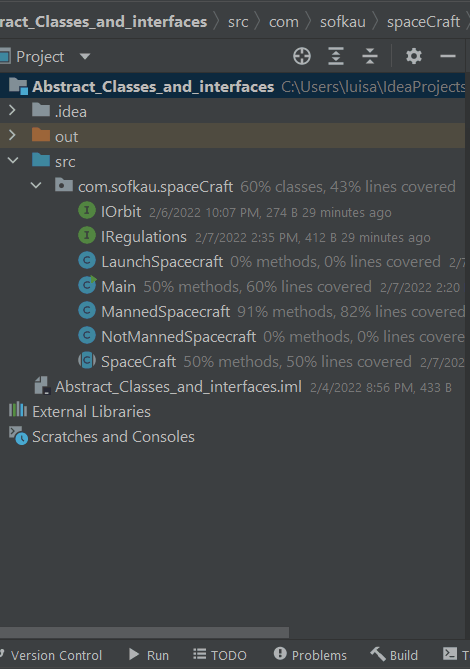
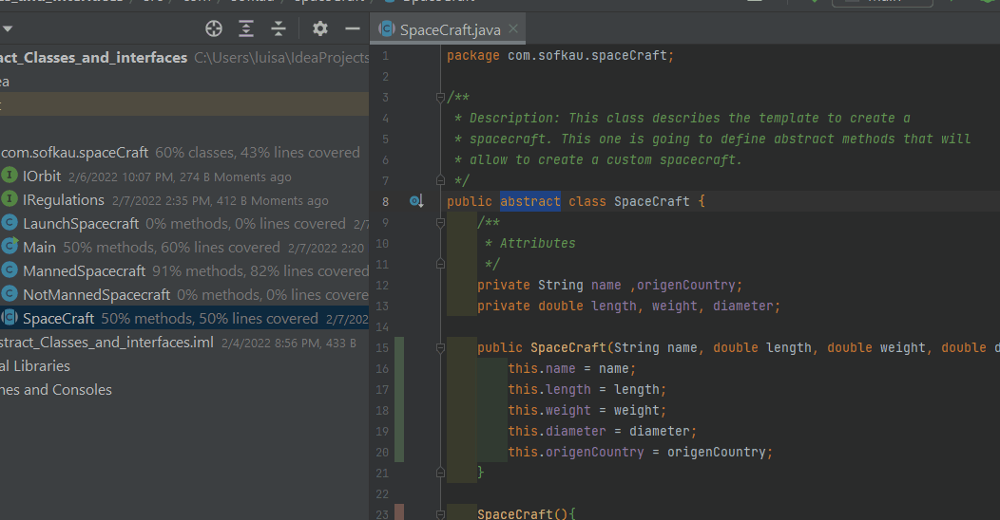
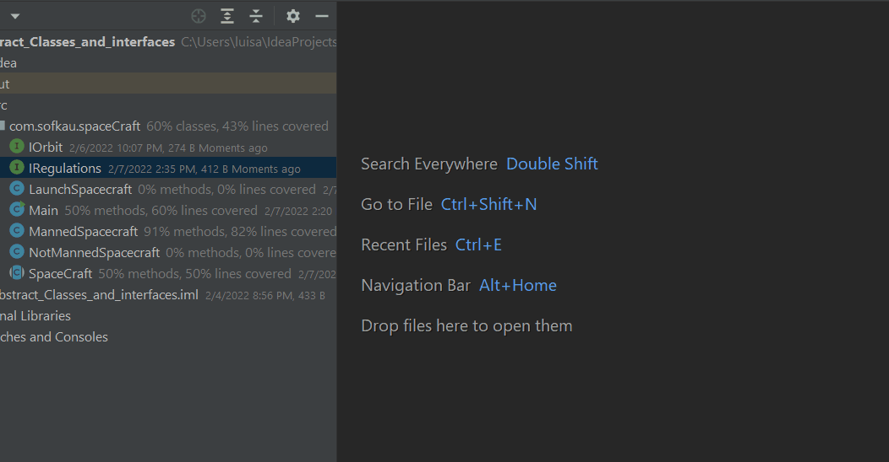
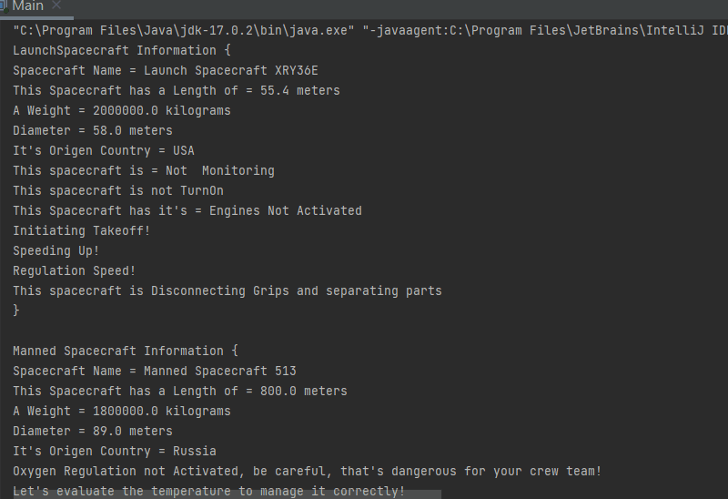

## Welcome to OOP with Java! 👋
# Abstraction and Interfaces in Java

*First let's define what is an Abtraction Class:*
A **Super Class** represents the first template for other classes that can extend it. It's a general class. The problem with it is that super classes represents a trubble when we make a modification in it's attributes and methods and there are extends made.
To solve super classe's problems *exist the Abstract Classes* whitch sonsiste in a class:

> - That can't be instantiated.
> - It's inheritances has to implement to override it's abstract methods.
> - A class with abstract methods got to be abstract as well.
> - A class can't extends more than one abstract class.

*Now let's define an Interface:*
An **Interface** allow us define or declarate functionalities or methods but we can't specify the code of every functionality. Interfaces:

> - Multiple inherence is allowed.
> - Just can define constants insides an interface.
> - A class can implement more than one interface.

*Let's create a Spacecraft:*
We need to create a Launch, Manned and No Manned spacescrafts. Then we can create a Spacecraft abstract class to make the spacecraft types extent from it.
This class is gonna define some abstract methods to implement in it's inheritances.
Then, to apply interfaces, we need to creat it and implement the einterface inside de classes that we need.

**Results**

**If you have any contribution it'll help me! :)**

